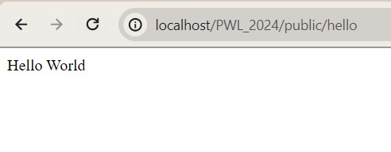
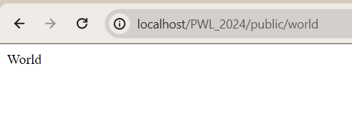

# Jobhseet 2 - Routing, Controller, dan View

Nama : Hilyatul Jannah \
Kelas : TI - 2F \
No.Absen/NIM : 28/2341728018

# Membuat 2 buah route

# route '/hello' dengan nilai return 'Hello World'

Pada tampilan halaman yang telah diketikkan sesuai dengan url, terdapat tulisan "Hello World" \

  \

 # route '/world' dengan nilai return 'World'

 Pada tampilan halaman yang telah diketikkan sesuai dengan url, terdapat tulisan "World" \

  \

# route '/' yang menampilkan pesan 'Selamat Datang'

 Pada tampilan halaman yang telah diketikkan sesuai dengan url, terdapat tulisan "Selamat Datang" \

  \

 # route ‘/about’ yang akan menampilkan NIM dan nama Anda

Pada tampilan halaman yang telah diketikkan sesuai dengan url, terdapat tulisan "Nama : Hilyatul Jannah dan NIM : 2341728018" \

  \
