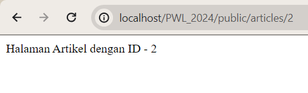

# Jobhseet 2 - Routing, Controller, dan View

Nama : Hilyatul Jannah \
Kelas : TI - 2F \
No.Absen/NIM : 28/2341728018

# Membuat 2 buah route

- route '/hello' dengan nilai return 'Hello World' 

Pada tampilan halaman yang telah diketikkan sesuai dengan url, terdapat tulisan "Hello World" 

  

 - route '/world' dengan nilai return 'World' 

 Pada tampilan halaman yang telah diketikkan sesuai dengan url, terdapat tulisan "World" 

  

- route '/' yang menampilkan pesan 'Selamat Datang' 

 Pada tampilan halaman yang telah diketikkan sesuai dengan url, terdapat tulisan "Selamat Datang" 

  

 - route ‘/about’ yang akan menampilkan NIM dan nama Anda 

Pada tampilan halaman yang telah diketikkan sesuai dengan url, terdapat tulisan "Nama : Hilyatul Jannah dan NIM : 2341728018" 

  

# route dengan parameter

- route /user/{name} sekaligus mengirimkan parameter berupa nama user $name 

Pada tampilan halaman yang telah diketikkan sesuai dengan url, terdapat tulisan "Hilyatul Jannah Hilya" yang mana "Hilya" merupakan parameter yang dipanggil 

 

- tampilan jika mengetikkan localhost/PWL_2024/public/user/ 

Muncul tulisan 404 NOT FOUND, dikarenakan kita tidak mencantumkan nilai parameternya 

 

- route dengan 2 paramater 

Pada tampilan ini muncul tulisan Pos ke-1 sesuai dengan post_id yang saya ketikkan dan komentar ke-5 sesuai dengan comment_id yang saya ketikkan 

 

- route  /articles/{id} yang akan menampilkan output “Halaman Artikel dengan ID {id}” 

Pada tampilan ini saya mengetikkan id dengan nilai 2, yang mana akan muncul tulisan Halaman Artikel dengan ID - 2 

 

# Paramater Opsional

- route /user sekaligus mengirimkan parameter berupa nama user $name dimana parameternya bersifat opsional. 

Pada tampilan ini hanya muncul keterangan Nama saya karena saya tidak menginputkan nilai untuk parameter Nama 

 

- route dengan url localhost/PWL_2024/public/user/NamaAnda. 

Pada tampilan ini  muncul keterangan Nama saya Hilya karena saya menginputkan nilai untuk parameter Nama 

 

- mengubah route dengan url localhost/PWL_2024/public/user/. 

Pada tampilan ini  muncul keterangan Nama saya John karena saya menginputkan nilai untuk parameter Nama dengan John

 

# Controller

- Membuat Controller
 

- Membuat controller hello
 
 

- Modifikasi Controller
 
 
 
 
 

- Modifikasi Single Action Controller
 
 
 
 
 

# Resource Controller
- Membuat controller
 
 
- Menampilkan "Hello, Hilyatul Jannah" dengan menggunakan view, dengan route memanggil view sesuai dengan nama file.

- File disimpan view dalam direktori blog. Menampilkan halaman yang sama seperti sebelumnya.

- Menggunakan controller untuk memanggil view. Routing akan memanggil controller terlebih dahulu, kemudian akan me-return view yang dituju.

- Mengubah hello.blade.php agar dapat menampilkan dua parameter..
